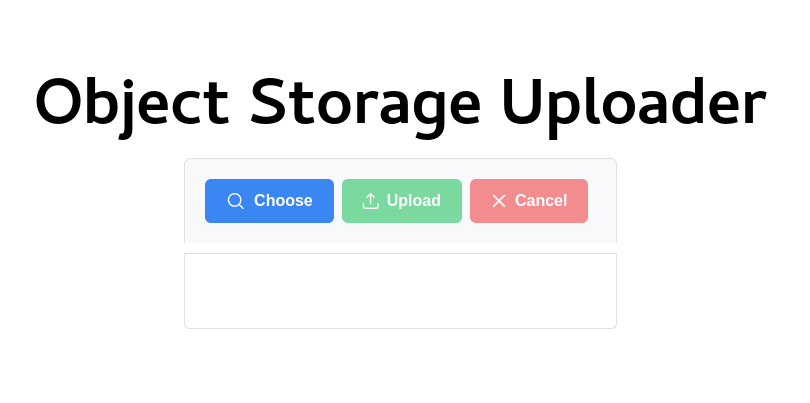

# Description

Upload file to Cloud Buckets

It uses IBM Cloud Object Storage for objects storage.

This is a [Next.js](https://nextjs.org/) project bootstrapped with [`create-next-app`](https://github.com/vercel/next.js/tree/canary/packages/create-next-app).



## Dependencies

In order to build this app, you will need:

* **An IBM Cloud Account** for Cloud Object Storage Service: [Create an account with IBM Cloud for free](https://cloud.ibm.com/registration).
* **Node 12** (LTS) or greater: [Install Node](https://www.notion.so/Instalando-o-Node-js-d40fdabe8f0a491eb33b85da93d90a2f).
* **Yarn** for project dependencies management: [Install Yarn](https://www.notion.so/Instalando-o-Yarn-eca6a13be5b3467d8d2f7be15c60f322).

## Local dev pre-requirements

### IBM Object Storage

Provision the **Object Storage** service clicking [here](https://cloud.ibm.com/objectstorage/create)

#### Gather credentials

* From the main navigation menu (☰), select **Resource list** to find **Cloud Object Storage** service under **Storage**.
* Click on **Cloud Object Storage** service -> **Service credentiais** and click on **New credential** button to create a new credential. 
* Click on **Advanced options** and turn on **Include HMAC credential**
* Click on **Add** button 
* Collect the **access_key_id** and **secret_access_key**

#### Create bucket

* Click on **Buckets** and, on **Create bucket** button, fill all info and save it
* Click on your newly created bucket and on **Configuration** tab
* Scroll down to **Endpoints** and collet the **public** url


## Building the App

1. Create a copy of `.env.example` file, naming it `.env` in the root of the directory, this is where we'll put the project's environment variables.
2. Add your keys to the .env file:
```
BUCKET_PUBLIC_ENDPOINT=your-public-url:goes-here
ACCESS_KEY_ID=your-access_key_id:goes-here
SECRET_ACCESS_KEY=your-secret_access_key:goes-here
BUCKET_NAME=your-bucket_name:goes-here
```
3. Navigate to project application directory and type into the console:

```bash
yarn
```

Yarn will download all project libraries

4. To start your project, type into the console

```bash
yarn dev
```

Your project will be available on http://localhost:3000

5. Alternatively, you can build the project for production using the following command

```bash
yarn build
```

Execute the production build using the following command

```bash
yarn start
```